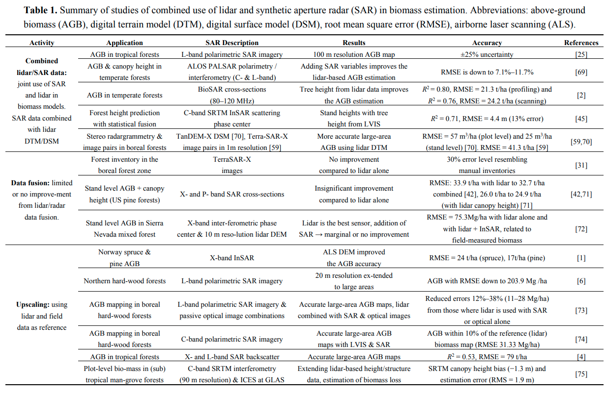
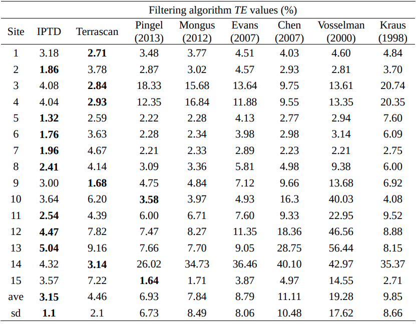
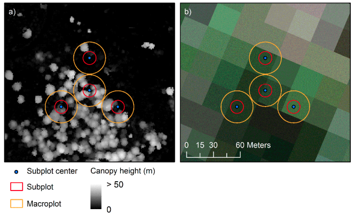
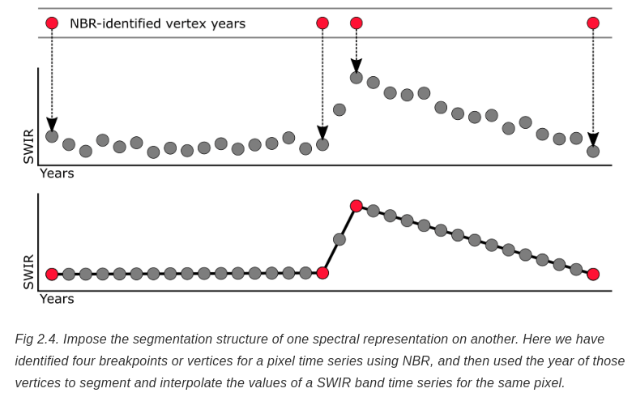

```{r setup, include=FALSE}
knitr::opts_chunk$set(echo = TRUE)

```

# Methodologies to quantify Californian forest ecosystems


## Summary

* Sentinel-2 derived vegetation indices can be used to to correlate with above-ground forest biomass (AGB)

* LiDAR requires higher resolution than size of the crown to identify individual trees, but is commonly used to estimate biomass in forests

* workflows to calculate biomass from FIA plots (Shana) are in practice (Hudak et al., 2020) 

* Landtrendr (Landsat, Google Earth) can be used to study forest regeneration patterns via normalised burn ratio (NBR) over large time intervals (30 years). Data can be used to estimate regeneration capability of forest entities 

* Landsat and Sentinel-2 often fails to discriminate for vegetation phenology and does reach a saturation point in dense forest where it fails to estimate biomass (150+ t/ ha)

* Forest classes are only available on request (ideally non-profit uni, time consuming process). Idea: Use Gradient nearest neighbours (GNN) so nearest plot imputes tree list (Van Kane, April 29 meeting)


## Sentinel 2


Compared to Landsat multispectral bands, the Sentinel-2 multispectral bands provide two red edge bands and one NIR band with improved spatial resolution. The Sentinel 2 bands can be used to derive various vegetation indices useful for discriminating between species and estimating forest biomass (Tab. 1)

\
Table. 1: Overview Sentinel 2 bands (Arcgis.com)
```{r, echo=FALSE}
sentinel2 <- read.csv(file="tables/sentinel2.csv",  
                                   header = TRUE)
knitr::kable(sentinel2)
```


\newpage
### Vegetation Indices

Vegetation indices including near-infrared wavelength have weaker relationships with biomass than those including shortwave infrared wavelength, especially for forest sites with complex stand structures. The results of image transformations such as the first principal component from the PCA showed stronger relationships with biomass than individual spectral bands, somehow independent of different biophysical conditions. However, in a study area with poor soil conditions and relatively simple forest stand structure, near-infrared band or relevant vegetation indices had a strong relationship with biomass (Lu et al., 2016)

\
Table. 2: Vegetation Indices derived from Sentinel 2 information (after Pandit et al., 2018)
```{r, echo=FALSE}
vegindices <- read.csv(file="tables/vegindices.csv",  
                                   header = TRUE)
knitr::kable(vegindices)
```


__Papers:__
\
Estimating ABG in sub-tropical Nepal using Sentinel 2 (Pandit et al., 2018). Field-based AGB as a dependent variable, as well as spectral band values and spectral-derived vegetation indices as independent variables in the Random Forest (Breiman, 2001). In this algorithm, decision trees are generated to the maximum extent without pruning using a randomly-selected two thirds of the samples as training data with bootstrapping (re-sampling the data many times with replacement), which strengthens the flexibility by aggregating the prediction across individual trees to make a final prediction. The paper ranks importance of spectral band data and vegetation indices from above (Tab. 2) as a typical output of a random forest to estimate AGB (R2 = 0.81 and RMSE = 25.57 t ha-1).


\newpage

### Normalised Burn Ratio

The Normalized Burn Ratio (NBR) is an index designed to highlight burnt areas in large fire zones (Lima et al. 2019) and can be derived from landsat or sentinel imagery. The formula is similar to NDVI, except that the formula combines the use of both near infrared (NIR) and shortwave infrared (SWIR) wavelengths (Fig 1). It can also be used to monitor forest disturbanches such as logging activities (Shimizu et al., 2017).The formula is similar to NDVI, NBR uses the ratio between NIR and SWIR bands. A high NBR value indicates healthy vegetation while a low value indicates bare ground and recently burnt areas. Non-burnt areas are normally attributed to values close to zero.
\
\
NBR = (NIR-SWIR)/(NIR+SWIR)
\
\

\

\
Fig: 1 Comparison of the spectral response of healthy vegetation and burned areas (USFS)

\

__Papers:__

Sentinel 2 data to create fire database in sub-Saharan Africa (Roteta et al., 2019). Sentinel-2 MSI reflectance measurements in the short and near infrared wavebands plus the active fires detected by Terra and Aqua MODIS sensor. They were able to detect smaller fires than with common MODIS approach, but Sentinel-2 based products have lower temporal resolution and consequently are more affected by cloud/cloud shadows. Available here: https://climate.esa.int/en/projects/fire/data/


Fire on Madeira, Spain (Navarro et al., 2017). Sentinel-2 data (5 days, 10 m resolution) for pre- and post-fire image assessments (sometimes just two). The framework can be used for the assessment of many other burnt areas globally. Enabling an extremely unprecedented perspective with a unique set of accurate, robust, timely and easily accessible information. No real measurement of accuracy provided. 

### Problems with Sentinel 2 Data

General problem with spatial resolution (30 m). The round FIA plots overlap with multiple pixels and sometimes the forest edge. Relatively new, so does not have the high temporal value as landsat. Will probably fail to distinguish tree phenology (e.g. growth stages) and can reach a spectral saturation point if biomass is too high.
\
__Papers:__
Bamboo forest in China: Seasonality, different growth phenomena in different years. Correlation between spectral bands and biomass varies within the period of months. Biomass calculation based on DBH and age (Y. Chen et al., 2019). Also used random forest to evaluate key variables.

### Sentinel-2 cleaning

The Sen2Cor atmospheric correlation processor (version 2.5.5) was used to conduct atmospheric correction. The Sen2Cor processor was developed for formatting and generating Sentinel-2 Level-2A products. The processor is freely available from the European Space Agency website (http://step.esa.int/main/third-party-plugins-2/sen2cor/). Resampled the Level-2A images to a 10 m spatial resolution utilizing the nearest neighbor algorithm, while Bands 1, 9, and 10 were discarded because they were dedicated for atmospheric correction and had coarse resolutions of 60 m. Afterwards, the images were co-registered to the LiDAR point clouds with an accuracy of less than 0.5 pixels. (Wang et al., 2020)

\newpage

## LiDAR

LiDAR data is the new standard when it comes to estimating AGB. Common procedure to calculate AGB via vegetation/canopy height and measure accuracy by comparing it to AGB derived from forest plots. Everything > 2m is typically classified as canopy (Joanathan Kane, 29 April meeting). Identification of individual trees only possible if resolution matches the size of the individual canopy (< 1m, Van Kane, 29 April meeting). LiDAR is useful to estimate vegetation metrics (basal area and stem density with r2 values of 0.86–0.95 across multiple studies, Zald et al., 2014)


Recent paper with Jonathan and Van Kane (Hudak et al. 2020):
\
Used a Carbon Monitoring System (CMS) to produce annual estimates of aboveground biomass using Random Forests (RF) for a regional and landscape approach. Field plots (mostly FIA) with self calculated AGB as a response variable to predict AGB from LiDAR derived canopy height and density information (R2 = 0.8, RMSE = 115 Mg ha-1, Bias = 2 Mg ha-1). A stratified random sample of AGB pixels from landscape-level AGB maps then served as training data for predicting AGB regionally from Landsat image time series variables processed through LandTrendr. Climate metrics calculated from downscaled 30 year climate normals were used as predictors for both models (landscape and regional), as were topographic metrics calculated from elevation data; these environmental predictors allowed AGB estimation over the full range of observations with the regional model (R2 = 0.8, RMSE = 152 Mg ha-1, Bias = 9 Mg ha-1), including higher AGB values (>400 Mg ha-1) where spectral predictors alone saturate. 


### Combination of LiDAR and other remotely sensed information for biomass estimation


A) Combination of LiDAR and QuickBird image did not improve AGB estimation in mixed coniferous forests in California; LiDAR data alone provided a better performance (Hyde et al., 2006)

B) LiDAR and hyperspectral combination has lower accuracy than LiDAR alone in tropical forest Costa Rica (Clark et al., 2011).

C) LiDAR and Synthetic Aperture Radar (SAR). Provide an overview table for all combinations and output accuracy (Fig. X, Kaasalainen et al., 2015). Upscaling refers to the extrapolation of LiDAR to areas where LiDAR is not available. Generally increases accuracy.


\
Fig: X: Overview of all combination of LiDAR and radar in research (Kaasalainen et al., 2015)


### LiDAR remove noise

A) Lastool in QGIS (LASnoise)
B) LiDAR360 3.1 software (GreenValley, Being,China) to remove the noise points floating between the flight altitude and the mangroves. (Wang et al., 2020). Triangulated irregular network (TIN) densification as a filtering algorithm to deal with complex forest landscapes (Zhao et al., 2016). See IPTD details below.


Improved progressive TIN densification filtering algorithm (IPTD) performs better than other general filtering algorithms (Fig. Y). The strength of 537 the IPTD lies in its ability to retain hilltops and handle break lines and steep slopes. Four parameters are used in the IPTD, i.e., k (neighboring number), r (threshold), 0 (iterative angle), and s (iterative distance). Densifies ground points and accounts for ground surface structure with (upward/downward densification) (Zhao et al., 2016).



\
Fig: Y: Comparison of kappa values (total error, TE) for LiDAR filtering algorithms for 15 sites tested. Lowest value in bold (Zhao et al., 2016)   

### Canopy height estimates from LiDAR (methods)

A) Australian wheat. 90 points/m2 by using sensor on farming vehicle coupled with multispectral to identify vegetation. (Walter et al., 2019).  Canopy height was extracted through percentile algorithm in R.

1) identifying the 98th percentile of maximum returned height in each scan line 
2) taking the 86th percentile of these values to provide an estimate of overall canopy height

86th percentile was selected through optimization of Pearson’s correlation coefficient and RMSE between lidar derived canopy height and measured canopy height for all sample times. More details in supplementary.

\

B) Honkong forest with thousands of individual tree measurements (dbh, height). (Chan et al., 2021)

LiDAR processed to TIN by extracting only the ground returns. Te extraction and processing were performed in ArcMap 10.5 with LAStools extension (https://rapidlasso.com/lastools/) and the FUSION 3.7 (http://forsys.cfr.washington.edu/fusion/fusionlatest.html). The canopy surface was defined using all non-ground returns with height above 2.0 m. The reason of choosing 2.0 m as the threshold was to avoid canopy returns to be mixed with ground returns. (Jonathan already said we just assume > 2m canopy, Apr 29 meeting).

Canopy Surface - Ground TIN = Normalized height of canopy points -> derive LiDAR metrics

Entire 1 ha study area was divided into circular plots with three plot sizes: 

(1) twenty-five 10m radius plots (16,182 stems)
(2) one-hundred 5m radius plot (15,538 stems) 
(3) four-hundred 2.5m radius plots (15,100 stems) 

Circular plots were considered more favorable than rectangular or square plots, since the periphery-to-area ratio was the smallest and thus minimized the number of edge trees (Köhl et al., 2006).


Relevant plot metrics (LiDAR, climate) were derived by the ‘cloudmetrics’ function in FUSION version 3.7. The LiDAR metrics, and its log-transformed metrics were input into stepwise regression model as independent predictors of AGB. Significant predictors were selected (F < 0.5 were entered and F > 1.0 were removed) into the regression model. Tree sets of regression models were generated and the allometric models tended to be linear and normal after logarithmic transformation (old ecology ref available if necessary). Logarithmic transformation increased accuary. Model predicted three parameters : (1) canopy cover by first returns, (2) 95th Height Percentile and (3) median of absolute deviation from mode (MADmode). Accuracy of predication increased with plot size.


\newpage

## Common LiDAR point metrics

There is a wealth of LiDAR plot metrics derived from the point clouds and they can even be used do discriminate forest tree species (with and without leaves) (Shi et al., 2018). They are created using height profiles and point distancing (for detailed table with references see Dong et al., 2017) and can be grouped in four categories:


1) height  (canopy height distributions within the plot) estimator for carbon and AGB (Lim & Treitz, 2004; Patenaude et al., 2004)
2) intensity (similar to the height metrics except that they are statistics of the intensity value rather than the height value of the point clouds, only finds application in high resolution LiDAR datasets)
3) density (canopy return density)
4) canopy volume (portray canopy morphology for canopy cover index or leaf area density)


\
Table. 1: Overview LiDAR derived metrics (taken from Wang et al., 2020)
```{r, echo=FALSE}
lidarmetrics <- read.csv(file="tables/lidarmetrics.csv",  
                                   header = TRUE)
knitr::kable(lidarmetrics)
```

## Upscaling LiDAR with Sentinel-2

LiDAR upscaling by integrating field plots (point), UAV-LiDAR strip (line) data and Sentinel-2 imagery (polygon) based on a point-line-polygon framework for AGB estimation (Wang et al., 2020).


## Field data

Application of LiDAR for forest inventory requires field plot data to ground-truth the information. Field plots need to incorporate relevant parameters (volume, basal area, biomass) (Hudak et al., 2020). FIA plot data provide an unbiased, systematic sample of forest conditions in space and time and are more applicable over larger areas and for successive effects such as climate change and forest regeneration rates (Tinkham et al., 2018).

### Shana sampling plots

Sampling plot data from the Forest Inventory and Analysis National Program (FIA).

* Allometric: DBH, size classes (e.g. saplings) > height groups, largest tree measured, height to live crown, crown ratio, crown width, age data sparse and based on 1-2 cores
* Biomass derived from LiDAR datasets
* plot center GPS using Javad
* plot date and size
* Ancillary data: Slope, ground cover, vegetation cover by type (e.g. shrub, forb, etc), modal vegetation height by different types of vegetation, fuel models, fuels data, seedlings, site history (e.g. plantation, if there was a fire, etc)

Sampling techniques used: https://www.fia.fs.fed.us/program-features/index.php

Forest plots are triangle with 4 circular subplots (Fig. 2), just assume they are representative of 1 ha of forest (Van Kane, 29 April meeting).Spatial mismatch between the 7.3 m radius, round configuration of an FIA subplot and 30 m × 30 m square Landsat pixels (Tinkham et al 2018). Inevitably, the four subplots will intersect a different number of pixels and in varying proportions.


Criteria to match LiDAR with FIA plots (Hudak et al., 2020):

* fixed-area plots
* georeferenced with a GNSS capable of differential correction 
* established within ±3 years of an overlapping LiDAR collection 
* not disturbed in the time between field and LiDAR data collections



\
Figure 2: FIA sampling plot layout. a) generated canopy height model from LiDAR and b) landsat 30m imagery overlay (taken from Hudak et al., 2020)


### Biomass estimation in the field

Collection of a large number of biomass reference data at the plot level is time-consuming and labor-intensive. It is only suitable for a small area and cannot provide the spatial distribution. However, this kind of data is a prerequisite for developing biomass estimation models (Lu et al., 2016). Allometric models most common, but require data about soil, land use history and climate influence (paper here for tropical) (Clark & Kellner, 2012).

Two methods: 

1) Use data of national forest inventories. Calculate with volume expansion factor (VEF), average wood density (WD), biomass expansion factor (BEF)(Brown et al., 1989; Lehtonen et al., 2004; Wang et al., 2011):

\
ABG (kg/ha) = volume (m3 / ha) * VEF * WD * BEF + e
\


2) Calculate AGB from field plots using equations from Fire and Fuels Extension (FFE) of the Forest Vegetation Simulator (FVS) (Rebain 2015, Dixon 2018). These equations are based on a series of regional volume and biomass equations. The aboveground portion of the live and standing dead trees were summed to a single, plot-level AGB value; the belowground portion of the trees and non-tree species were excluded from the AGB estimates. These plot-level AGB estimates were the response variable for a landscape model (Hudak et al., 2020).


### Problems with field data 


Taken from Lu et al., 2016:

(1) tree variables, including sampling, measurement, recording and grouping errors when tree variables such as DBH and height are measured;
(2) conversion coefficients and models including variation of conversion factors from volume to biomass and then to carbon, inappropriate selection and usage of allometric models for relationship of tree volume and DBH and height, and incorrect regression models relating forest biomass/carbon to spectral variables;
(3) uncertainties of spectral values due to unbalanced platforms, scanner motions, poor atmospheric conditions, and slope; inappropriate spatial interpolation methods for geometrical and radiometric corrections, and incorrect methods for image enhancement and analysis;
(4) sample plot locations, including global positing system (GPS) coordinates used to locate the sample plots, geometric correction and the uncertainties due to mismatch of sample plots with spatial resolutions of remotely sensed data; 
(5) differences in sizes of sample plots and image pixels, disagreement between remotely sensed data and plot observations when portions of trees on boundaries are outside plots although both sample plots and pixels have the same spatial resolutions; and 
(6) temporal differences between field plot measurements and remotely sensed data.

\
Depending on the protocol and the quality of the Global Navigation Satellite System (GNSS) receiver used in the field; the
three peripheral subplots, while systematically laid out from the center subplot by consistent distances
(36.6 m) and bearings (120◦, 240◦, 360◦) are usually not georeferenced, making them more subject to locational inaccuracy due to additive errors in accounting for horizontal distance on slopes and for magnetic declination on compass azimuths (Zald et al., 2014).

### Forest classification

Van Kane (meeting Apr 29): 
forest service cannot reveal plot locations, only if project output is open access (ideally uni projects)
Idea: Use Gradient nearest neighbours (GNN) so nearest plot imputes tree list

\newpage
## Other relevant datasets

### Landsat


\
Table. 3: Landsat 8-9 Operational Land Imager (OLI) and Thermal Infrared Sensor (TIRS) (USGS, 2018)
```{r, echo=FALSE}
landsat <- read.csv(file="tables/landsat.csv",  
                                   header = TRUE)
knitr::kable(landsat)
```


__LandTrendr__ is set of spectral-temporal segmentation algorithms that are useful for change detection in a time series of moderate resolution satellite imagery (primarily Landsat) and for generating trajectory-based spectral time series data largely absent of inter-annual signal noise. Can be used to assess forest regeneration over larger timescales (Fig. 3). They provide a github repository evaluating how to extract the data from e.g. Google Earth (https://emapr.github.io/LT-GEE/landtrendr.html).



Figure 3: Pixel change over updated intervals for the Normalised Burn Ratio (NBR) 


__Papers:__

Jonathan Kane paper (Kolden et al., 2012). Characterized unburned area within fire perimeters by fire size and severity, characterized distance to an unburned area across the burned portion of the fire, and investigated patch dynamics of unburned patches within the fire perimeter. From 1984 through 2009, the total area within the fire perimeters that was classified as unburned from dNBR was 37% for Yosemite, 17% for Glacier, and 14% for Yukon-Charley.

The complex biophysical environments and vegetation characteristics, e.g. phenology, species composition, growth phase, and health – will affect vegetation spectral signatures; thus, biomass estimation models based on optical spectral features cannot be directly transferred to different study areas for biomass mapping (Foody et al., 2003; Lu, 2005)

Combination of Landsat and land cover to estimate AGB in Uganda (Avitabile et al., 2012). A regression tree-based model (Random Forest) produces good results (cross-validated R² 0.81, RMSE 13 T/ha) when trained with a sufficient number of field plots representative of the vegetation variability at national scale. Specific limitations are mainly related to saturation of the optical signal at high biomass density and cloud cover, which hinders the compilation of a radiometrically consistent multi-temporal dataset. Land cover data increases the model performance because it provides information on vegetation phenology .


### Synthetic aperture radar (SAR) 
Most radar-based biomass estimation studies use L-band SAR data, especially the ALOS PALSAR L-band data (Mitchard et al. 2011; Carreiras et al. 2012; Rahman and Sumantyo 2013). The SAR C-band data have not been extensively used because of the C-band’s inability to capture forest biomass features (Le Toan et al. 1992; Lu 2006).

In summary, it is difficult to use radar data for distinguishing vegetation types (Li et al. 2012b) because radar data reflect the roughness of land cover surfaces instead of the difference between the vegetation types, thus resulting in difficulty of biomass estimation. The speckle in radar data is another problem affecting its applications. Properly employing filtering methods to reduce noise and outliers in InSAR data is needed to improve the vegetation height estimation performance (Kellndorfer et al. 2004).


### NASA-GEDI LiDAR

GEDI has the highest resolution and densest sampling of any LiDAR ever put in orbit (25 m to 1 km resolution)

Website: https://gedi.umd.edu/


### RapidEye

ESA is offering access to the full RapidEye archive for scientific research and application development. Access is only available to submitted proposals that are accepted. 5 m pixel size (RGB, RE and NIR). __Overall, RapidEye data are not suitable for AGB estimation__, but when AGB falls within 50–150 Mg/ha, support vector regression based on stratification of vegetation types provided good AGB estimation; Problem for biomass estimates can be fixed incorporating tree height if LiDAR data or stereo image is available (Brasilian Rainforest) (Feng et al., 2017) 

### ICESat-2

Ice, Cloud and Land Evalutation Satellite, 91-day repeat
\
While ATLAS onboard ICESat-2 was primarily designed to determine changes in ice sheet elevation
and mass, it will provide information about vegetation that may be used to estimate AGB. ATLAS
is a photon counting system, operating in the visible wavelengths, at 532 nm [7]. It generates three
pairs of tracks, with each pair approximately 3.3 km apart and each track within a pair separated
by 90 m [11]. LiDAR footprints are produced every 70 cm in the along-track direction and measure
approximately 14 m in diameter [14]. Given the unprecedented coverage and spatial detail from
ICESat-2, translating ICESat-2 measurements to AGB estimates would allow for large-scale AGB and
forest carbon assessments.

__Paper:__
ICESat-2 for mapping forest biomass with deep learning (Narine et al., 2019). A first set of models were developed using vegetation indices
calculated from single-date Landsat imagery, canopy cover, and land cover, and a second set of models were generated using metrics from one year of Landsat imagery with canopy cover and land cover maps. With the extended dataset containing metrics calculated from Landsat images acquired on different dates, substantial improvements in modelperformance for all data scenarios were noted. The R2 values increased to 0.64, 0.66, and 0.67. Comparisons with Random forest (RF) prediction models highlighted similar results, with the same R2 and root mean square error (RMSE) range (15–16 Mg/ha) for daytime and nighttime scenarios. ICESat-2 profiles, especially with the nighttime scenario (R2 = 0.66), highlight the potential for generating a wall-to-wall AGB product with ICESat-2 by adopting a synergistic approach with Landsat optical imagery, canopy cover, and land cover 

### Climate data

__Paper:__
For climate, data were used from the North American Regional Reanalysis (NARR) (Mesinger et al 2006), the National Center for Environmental Prediction’s high-resolution combined model and assimilated dataset available eight-times daily 1979-2000 at 32 km resolution. Ecosystem demography model trained with hourly land surface weather data to calculate carbon assimilation rate and transpiration (2 m air temperature, dew point, downward solar radiation, precipitation, soil temperature)(Hurtt et al., 2019).

(Hongkong Forest) (Chan et al., 2021):
Three parameters to account for climatic variations: Temperature seasonality (TS), Long-term Maximum Climatological Water Defcit (CWD) and Precipitation Seasonality (PS) (Hongkong Forest)

# References


ArcGIS.com. (2021). Sentinel-2 Imagery: Normalized Burn Ratio—Overview. https://www.arcgis.com/home/item.html?id=5cbafcf777e845129771e601701aaae7

Avitabile, V., Baccini, A., Friedl, M. A., & Schmullius, C. (2012). Capabilities and limitations of Landsat and land cover data for aboveground woody biomass estimation of Uganda. Remote Sensing of Environment, 117, 366–380. https://doi.org/10.1016/j.rse.2011.10.012

Breiman, L. (2001). Random Forests. Machine Learning, 45(1), 5–32. https://doi.org/10.1023/A:1010933404324

Brown, S., Gillespie, A., & Lugo, A. (1989). Biomass Estimation Methods for Tropical Forests with Applications to Forest Inventory Data. Forest Science, 35, 881–902.

Chan, E. P. Y., Fung, T., & Wong, F. K. K. (2021). Estimating above-ground biomass of subtropical forest using airborne LiDAR in Hong Kong. Scientific Reports, 11(1), 1751. https://doi.org/10.1038/s41598-021-81267-8

Chen, Y., Li, L., Lu, D., & Li, D. (2019). Exploring Bamboo Forest Aboveground Biomass Estimation Using Sentinel-2 Data. Remote Sensing, 11(1), 7. https://doi.org/10.3390/rs11010007

Clark, D. B., & Kellner, J. R. (2012). Tropical forest biomass estimation and the fallacy of misplaced concreteness. Journal of Vegetation Science, 23(6), 1191–1196. https://doi.org/10.1111/j.1654-1103.2012.01471.x

Clark, M. L., Roberts, D. A., Ewel, J. J., & Clark, D. B. (2011). Estimation of tropical rain forest aboveground biomass with small-footprint LiDAR and hyperspectral sensors. Remote Sensing of Environment, 115(11), 2931–2942. https://doi.org/10.1016/j.rse.2010.08.029

Feng, Y., Lu, D., Chen, Q., Keller, M., Moran, E., dos-Santos, M. N., Bolfe, E. L., & Batistella, M. (2017). Examining effective use of data sources and modeling algorithms for improving biomass estimation in a moist tropical forest of the Brazilian Amazon. International Journal of Digital Earth, 10(10), 996–1016. https://doi.org/10.1080/17538947.2017.1301581

Foody, G. M., Boyd, D. S., & Cutler, M. E. J. (2003). Predictive relations of tropical forest biomass from Landsat TM data and their transferability between regions. Remote Sensing of Environment, 85(4), 463–474. https://doi.org/10.1016/S0034-4257(03)00039-7

Frampton, W. J., Dash, J., Watmough, G., & Milton, E. J. (2013). Evaluating the capabilities of Sentinel-2 for quantitative estimation of biophysical variables in vegetation. ISPRS Journal of Photogrammetry and Remote Sensing, 82, 83–92. https://doi.org/10.1016/j.isprsjprs.2013.04.007

Gitelson, A., & Merzlyak, M. N. (1994). Spectral Reflectance Changes Associated with Autumn Senescence of Aesculus hippocastanum L. and Acer platanoides L. Leaves. Spectral Features and Relation to Chlorophyll Estimation. Journal of Plant Physiology, 143(3), 286–292. https://doi.org/10.1016/S0176-1617(11)81633-0

Hardisky, M., Klemas, V., & Smart,  and. (1983). The influence of soil salinity, growth form, and leaf moisture on the spectral radiance of Spartina Alterniflora canopies. Photogrammetric Engineering and Remote Sensing, 48, 77–84.

Hill, M. J. (2013). Vegetation index suites as indicators of vegetation state in grassland and savanna: An analysis with simulated SENTINEL 2 data for a North American transect. Remote Sensing of Environment, 137, 94–111. https://doi.org/10.1016/j.rse.2013.06.004

Hudak, A. T., Fekety, P. A., Kane, V. R., Kennedy, R. E., Filippelli, S. K., Falkowski, M. J., Tinkham, W. T., Smith, A. M. S., Crookston, N. L., Domke, G. M., Corrao, M. V., Bright, B. C., Churchill, D. J., Gould, P. J., McGaughey, R. J., Kane, J. T., & Dong, J. (2020). A carbon monitoring system for mapping regional, annual aboveground biomass across the northwestern USA. Environmental Research Letters, 15(9), 095003.

Huete, A., Didan, K., Miura, T., Rodriguez, E. P., Gao, X., & Ferreira, L. G. (2002). Overview of the radiometric and biophysical performance of the MODIS vegetation indices. Remote Sensing of Environment, 83(1), 195–213. https://doi.org/10.1016/S0034-4257(02)00096-2

Huete, A. R. (1988). A soil-adjusted vegetation index (SAVI). Remote Sensing of Environment, 25(3), 295–309. https://doi.org/10.1016/0034-4257(88)90106-X

Hyde, P., Dubayah, R., Walker, W., Blair, J. B., Hofton, M., & Hunsaker, C. (2006). Mapping forest structure for wildlife habitat analysis using multi-sensor (LiDAR, SAR/InSAR, ETM+, Quickbird) synergy. Remote Sensing of Environment, 102(1), 63–73. https://doi.org/10.1016/j.rse.2006.01.021

Jordan, C. F. (1969). Derivation of Leaf-Area Index from Quality of Light on the Forest Floor. Ecology, 50(4), 663–666. https://doi.org/10.2307/1936256

Kaasalainen, S., Holopainen, M., Karjalainen, M., Vastaranta, M., Kankare, V., Karila, K., & Osmanoglu, B. (2015). Combining Lidar and Synthetic Aperture Radar Data to Estimate Forest Biomass: Status and Prospects. Forests, 6(1), 252–270. https://doi.org/10.3390/f6010252

Köhl, M., Magnussen, S. S., & Marchetti, M. (2006). Sampling Methods, Remote Sensing and GIS Multiresource Forest Inventory. Springer-Verlag. https://doi.org/10.1007/978-3-540-32572-7

Kolden, C. A., Lutz, J. A., Key, C. H., Kane, J. T., & van Wagtendonk, J. W. (2012). Mapped versus actual burned area within wildfire perimeters: Characterizing the unburned. Forest Ecology and Management, 286, 38–47. https://doi.org/10.1016/j.foreco.2012.08.020

Kross, A., McNairn, H., Lapen, D., Sunohara, M., & Champagne, C. (2015). Assessment of RapidEye vegetation indices for estimation of leaf area index and biomass in corn and soybean crops. International Journal of Applied Earth Observation and Geoinformation, 34, 235–248. https://doi.org/10.1016/j.jag.2014.08.002

Lehtonen, A., Mäkipää, R., Heikkinen, J., Sievänen, R., & Liski, J. (2004). Biomass expansion factors (BEFs) for Scots pine, Norway spruce and birch according to stand age for boreal forests. Forest Ecology and Management, 188(1), 211–224. https://doi.org/10.1016/j.foreco.2003.07.008

Lim, K. S., & Treitz, P. M. (2004). Estimation of above ground forest biomass from airborne discrete return laser scanner data using canopy-based quantile estimators. Scandinavian Journal of Forest Research, 19(6), 558–570. https://doi.org/10.1080/02827580410019490

Lu, D. (2005). Aboveground biomass estimation using Landsat TM data in the Brazilian Amazon. International Journal of Remote Sensing, 26(12), 2509–2525. https://doi.org/10.1080/01431160500142145

Lu, D., Chen, Q., Wang, G., Liu, L., Li, G., & Moran, E. (2016). A survey of remote sensing-based aboveground biomass estimation methods in forest ecosystems. International Journal of Digital Earth, 9(1), 63–105. https://doi.org/10.1080/17538947.2014.990526

Lu, D., Chen, Q., Wang, G., Moran, E., Batistella, M., Zhang, M., Vaglio Laurin, G., & Saah, D. (2012). Aboveground Forest Biomass Estimation with Landsat and LiDAR Data and Uncertainty Analysis of the Estimates. International Journal of Forestry Research, 2012. https://doi.org/10.1155/2012/436537

Merzlyak, M. N., Gitelson, A. A., Chivkunova, O. B., & Rakitin, V. Y. (1999). Non-destructive optical detection of pigment changes during leaf senescence and fruit ripening. Physiologia Plantarum, 106(1), 135–141. https://doi.org/10.1034/j.1399-3054.1999.106119.x

Mesinger, F., Dimego, G., Kalnay, E., Mitchell, K., Shafran, P., Ebisuzaki, W., Jović, D., Woollen, J., Rogers, E., Berbery, E., Ek, M., Fan, Y., Grumbine, R., Higgins, W., Li, H., Lin, Y., Manikin, G., Parrish, D., & Shi, W. (2006). North American Regional Reanalysis. BAMS, 3, 343–360. https://doi.org/10.1175/BAMS-87-3-343

Narine, L. L., Popescu, S. C., & Malambo, L. (2019). Synergy of ICESat-2 and Landsat for Mapping Forest Aboveground Biomass with Deep Learning. Remote Sensing, 11(12), 1503. https://doi.org/10.3390/rs11121503

Navarro, G., Caballero, I., Silva, G., Parra, P.-C., Vázquez, Á., & Caldeira, R. (2017). Evaluation of forest fire on Madeira Island using Sentinel-2A MSI imagery. International Journal of Applied Earth Observation and Geoinformation, 58, 97–106. https://doi.org/10.1016/j.jag.2017.02.003

Pandit, S., Tsuyuki, S., & Dube, T. (2018). Estimating Above-Ground Biomass in Sub-Tropical Buffer Zone Community Forests, Nepal, Using Sentinel 2 Data. Remote Sensing, 10(4), 601. https://doi.org/10.3390/rs10040601

Patenaude, G., Hill, R. A., Milne, R., Gaveau, D. L. A., Briggs, B. B. J., & Dawson, T. P. (2004). Quantifying forest above ground carbon content using LiDAR remote sensing. Remote Sensing of Environment, 93(3), 368–380. https://doi.org/10.1016/j.rse.2004.07.016

Roteta, E., Bastarrika, A., Padilla, M., Storm, T., & Chuvieco, E. (2019). Development of a Sentinel-2 burned area algorithm: Generation of a small fire database for sub-Saharan Africa. Remote Sensing of Environment, 222, 1–17. https://doi.org/10.1016/j.rse.2018.12.011

Sharma, L. K., Bu, H., Denton, A., & Franzen, D. W. (2015). Active-Optical Sensors Using Red NDVI Compared to Red Edge NDVI for Prediction of Corn Grain Yield in North Dakota, U.S.A. Sensors, 15(11), 27832–27853. https://doi.org/10.3390/s151127832

Sims, D. A., & Gamon, J. A. (2002). Relationships between leaf pigment content and spectral reflectance across a wide range of species, leaf structures and developmental stages. Remote Sensing of Environment, 81(2), 337–354. https://doi.org/10.1016/S0034-4257(02)00010-X

Tucker, C. J. (1979). Red and photographic infrared linear combinations for monitoring vegetation. Remote Sensing of Environment, 8(2), 127–150. https://doi.org/10.1016/0034-4257(79)90013-0

USGS. (2018). What are the band designations for the Landsat satellites? https://www.usgs.gov/faqs/what-are-band-designations-landsat-satellites?qt-news_science_products=0#qt-news_science_products

Walter, J. D. C., Edwards, J., McDonald, G., & Kuchel, H. (2019). Estimating Biomass and Canopy Height With LiDAR for Field Crop Breeding. Frontiers in Plant Science, 10. https://doi.org/10.3389/fpls.2019.01145

Wang, G., Zhang, M., Gertner, G. Z., Oyana, T., McRoberts, R. E., & Ge, H. (2011). Uncertainties of mapping aboveground forest carbon due to plot locations using national forest inventory plot and remotely sensed data. Scandinavian Journal of Forest Research, 26(4), 360–373. https://doi.org/10.1080/02827581.2011.564204

Wang, D., Wan, B., Liu, J., Su, Y., Guo, Q., Qiu, P., & Wu, X. (2020). Estimating aboveground biomass of the mangrove forests on northeast Hainan Island in China using an upscaling method from field plots, UAV-LiDAR data and Sentinel-2 imagery. International Journal of Applied Earth Observation and Geoinformation, 85, 101986. https://doi.org/10.1016/j.jag.2019.101986

